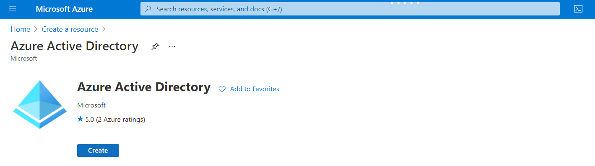
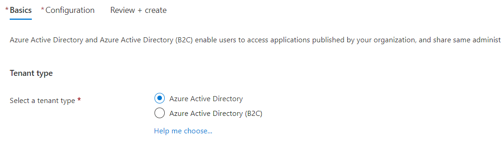
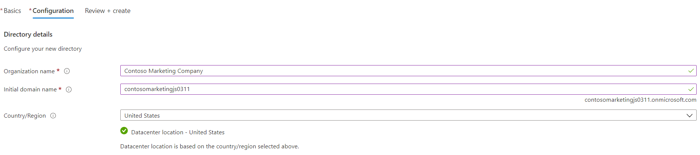
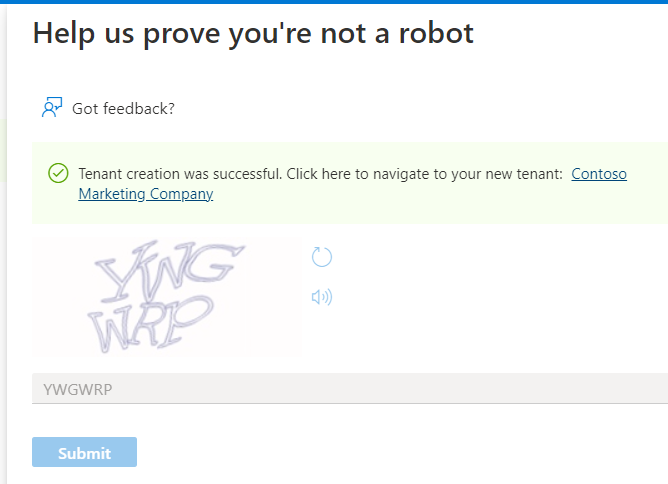
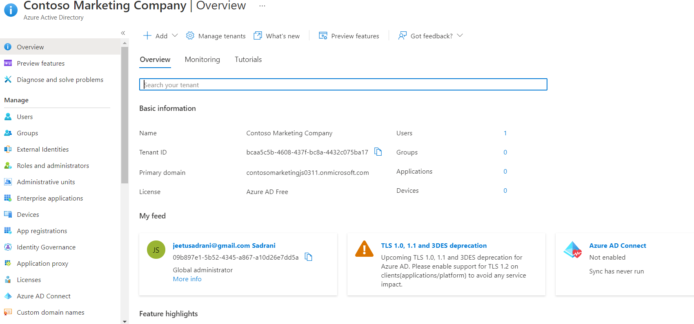
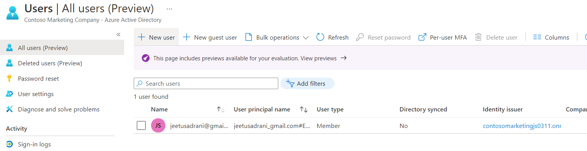
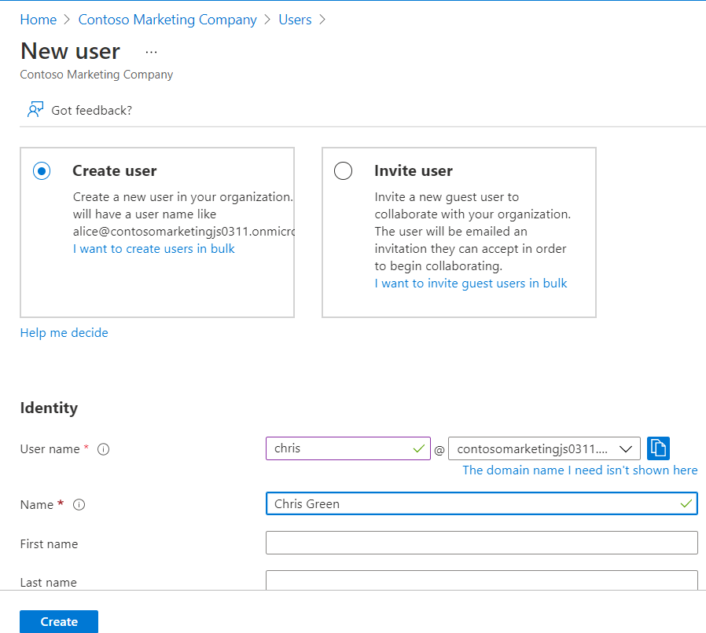
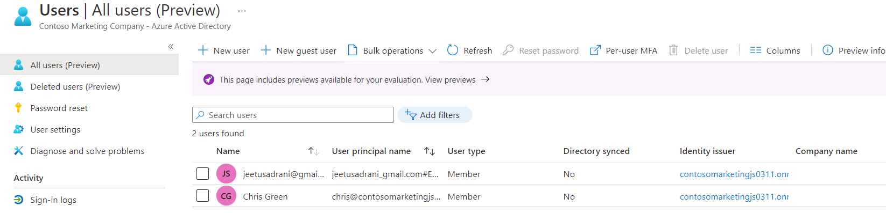
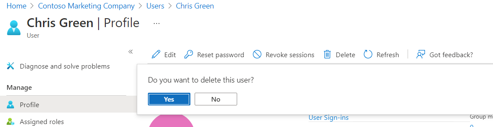
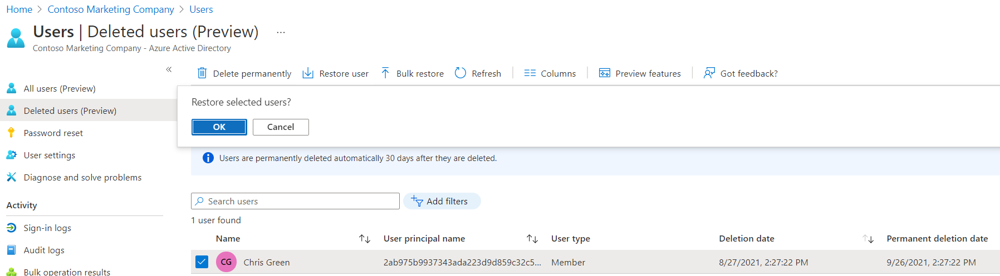

# Users and Groups in Azure AD

The First step is to create the Azure Active Directory that will holds all the user and groups.

<ul>
  
  <li>For creating <b>Azure Active Directory</b>, search for azure active directory under the Azure Services and click on create</li>
  
  
  <li>In the <b>Basic</b> tab, select tenant type as Azure Active Directory</li>
  
  
  <li>In the next tab Configuration provide the Directory Details</li>
  
  
  <li>After the validation passed, <b>Help us prove you're not a robot</b> this pane will appears</li>
  <li>Select <b>submit</b> after entering the text and navite to your new tenant created</li>
  
  
  
  <li>Overview pane will appear for the Azure Active Directory</li>
  
</ul>

# Add a New User
  
<ul>
  
  <li>In the left menu pane, under <b>Manage</b> select <b>Users</b>. Click on <b>New User</b> from the top menu</li>
  
  
  <li>under the <b>Identity</b>, provide the <b>User Name</b> and <b>Name</b> of the user.</li>
  
  
  <li>Click on <b>Create</b> and new user will be created</li>
  
</ul>

# Delete a User
<ul>
  
  <li>If you want to delete the user, select the  profile of the user and from the top menu click on <b>Delete</b></li>
  
  
  <li>You can even restore the deleted users</li>
  
  <li>To do this, under All users pane select <b>Deleted users</b>. Here you can see the users that were deleted within the last 30 days</li>
  
  <li>Select the user and click on <b>Restore user</b> from the top menu</li>
  
</ul>

# Create a new group

<ul>
  
  <li>Under <b>Manage</b> select <b>Groups</b>. Click on <b>New group</b></li>
  
  
  <li>Provide the details in the <b>New Page</b> pane and select <b>Create</b></li>
  
  
  <li>New group will be created. You can add members in the group under <b>Members</b> pane from left menu</li>
  
</ul>

# Add guest user to the organization

<ul>
  <li>Under the all users pane, select <b>New guest user</b> from the top menu</li>
  
  
  <li>Under the <b>Invite user</b>, provie <b>Name</b> and <b>Email address</b> of the user</li>
  
  
  <li>You will see the invited user in the all users pane. Notice it has <b>User type</b> as <b>Guest</b></li>
  
  
</ul>

# Add guest user to an application

We can give access to the guest user for specific application within azure active directory

<ul>
  
  <li>First step is create a new application in Azure AD, for that go to Azure AD organization and under <b>Manage</b> select <b>Enterprise applications</b></li>
  
  <li>Click on <b>New application</b></li>
  
  
  <li>Search for the application you want, under the <b>Users and groups</b> add the guest user</li>
  
</ul>
