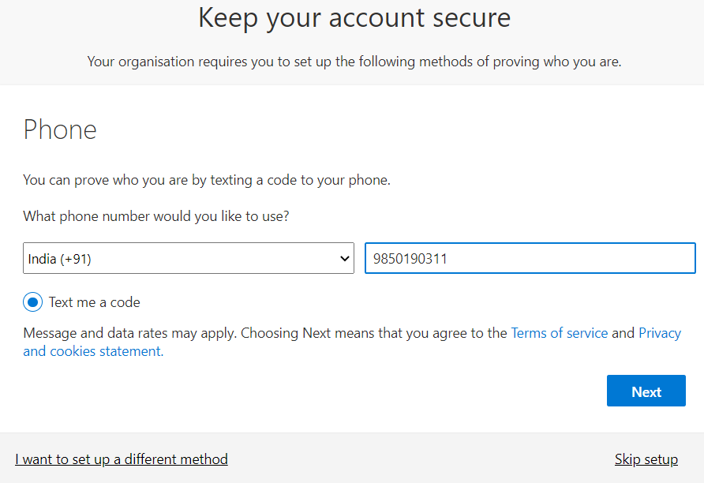

# Set up Self-service password reset

In this we will configure and test the Self-service password reset by using mobile phone. <b>Note</b> For this you will need <b>Azure AD Premium P2</b>

<ul>
  
  <li>First create a Security group for which we want to test Self-service password reset</li>
  
  <li>In the Azure AD under <b>Manage</b>, select <b>Groups</b> and click on <b>+ New Group</b></li>
  
  
  <li>Create a User account in that security group. For that under <b>Manage</b> select <b>Users</b> and click on <b>+ New user</b><li>
  
</ul>   

# Enable Self-service password reset(SSPR)

<ul>
  <li>In the Azure AD, under <b>Manage</b>, select <b>Password reset</b></li>
  <li>On the Properties page, select <b>Selected</b>. Select the required group, and then select <b>Save</b></li>
  

  <li>You can change the remaining settings or leave it as default for <b>Authentication methods</b>, <b>Registration</b>, and <b>Notifications</b></li>
    
</ul>

# Register for Self-service password reset(SSPR)

<ul>
  
  <li>In the new brower window, go to  https://aka.ms/ssprsetup </li>
  
  <li>Sign in with the user account that you created earlier</li>
  
  
  <li>You will be ask to update your password. Make sure you remember the new password</li>
  
  
  <li>You will be ask for your Phone number. Provide the phone number and you will receive the 6-digit code on your mobile phone, enter that code.</li>
  
  
  
  <li>After verify, success message will be displayed on the screen</li>
  
  
  <li>For testing Self-service password reset(SSPR), in the new browser window go to https://aka.ms/sspr </li>
  
  <li>Provide the Email or Username of the User account and complete the captcha</li>
  
  
  <li>Enter the mobile phone number, and then select Text</li>
  
  
  <li>Enter the Verification code in the box and select next</li>
  <li>Enter a new password, and then select Finish. Make sure you note the new password</li>
  
  
