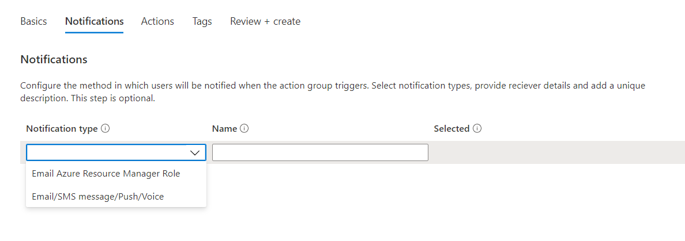

## Step: Add the alerts 

The users should get notification when some conditions met like when there is a resource which is not properly utilized for last some days, the cost can be reduced for such resouces.

- When writing the log queries there is an option for the **+ New alert rule** in the top menu. This will be based on that specific query.
- Click on that, the condition should be already there define the logic in that condition
- Now click on the **Add action group**, in that we can add the email address or SMS for the required user which will be notified 
- The steps are shown below:

- Click on the condition so that you can define the logic behind that condition

- After Defining the logic click on **Done**

**Case 1:**

- This condition will trigger the alert when the **average CPU utilization is more than 90%**
- In the query we have defined the average CPU utilization, when the threshold value will become greater than 90 the alert will fired.
- We are calculating the avearage CPU utilization for last 15 minutes, which is evaluated every 5 minutes. The query is given below:
   
       Perf
       | where ObjectName == "Processor" and CounterName == "% Processor Time" and InstanceName == "_Total"
       | summarize AggregatedValue = avg(CounterValue) by Computer,bin(TimeGenerated,15m)

- Give the proper Alert rule name, the description of alert, if the alert is critical then the severity of the alert and at last click on Create alert rule

---

**Case 2:**

- This condition will trigger the alert when the **average CPU utilization is less than 10% in last 2 days**
- In the query we have defined the average CPU utilization, when the threshold value will become less than 10 the alert will fired.
- We are calculating the avearage CPU utilization for last 2 days, which is evaluated every 5 minutes. The query is given below:

      Perf
      | where ObjectName == "Processor" and CounterName == "% Processor Time" and InstanceName == "_Total"
      | summarize AggregatedValue = avg(CounterValue) by Computer,bin(TimeGenerated,15m)

- Give the proper Alert rule name, the description of alert, if the alert is critical then the severity of the alert and at last click on Create alert rule

---

**Case 3:**

- This condition will trigger the alert when the **average Memory utilization is greater than 90%**
- In the query we have defined the average Memory utilization, when the threshold value will become greater than 90 the alert will fired.
- We are calculating the avearage Memory utilization for last 30 minutes, which is evaluated every 5 minutes. The query is given below:

      Perf
      | where CounterName == "% Committed Bytes In Use" or CounterName == "% Used Memory"
      | summarize AggregatedValue = avg(CounterValue) by Computer,bin(TimeGenerated,15m)

- Give the proper Alert rule name, the description of alert, if the alert is critical then the severity of the alert and at last click on Create alert rule

---

**Case 4:**

- This condition will trigger the alert when the **average % free space of disk is greater than 90%**
- We are calculating the avearage % free space of disk for last 2 days, which is evaluated every 5 minutes. The query is given below:

      Perf
      | where ObjectName == "LogicalDisk" and CounterName == "% Free Space"
      | where InstanceName != "_Total"
      | where InstanceName !startswith "HarddiskVolume"
      | summarize AggregatedValue = avg(CounterValue) by Computer,bin(TimeGenerated,15m),InstanceName

- Give the proper Alert rule name, the description of alert, if the alert is critical then the severity of the alert and at last click on Create alert rule

---

- An action group is a collection of notification preferences defined in the Azure. To add the action group click on **Add action group**

- Provide the basic details on the **Basics** tab

- On the notification tab, select the notification type as **Email/SMS message/Push/Voice**

- Enter the **Email** and **Phone number** of the user who you want to receive the notification when the alert is fired
> Note: You have to enter the valid Email and Phone number

- When the alert is fired, it should perform some action. We can define those action type on the **Actions** tab

- Click on **Review and create** and wait for the deployment to complete.

---

- Now the **Alert rule** has been added. In some scenario during planned maintenance, you want to suppress the notifications of the alert. Here we can use **Action rule**

- Go to the **Alerts** page on **Monitor** and click on **Action rules**. After that select **+ Create**

- New window will appear. Select the **Scope** on which you want to apply the action rule. You can select the **Suppression** or **Action group**

- You can select for what time range the alert should suppressed. There are options like *At scheduled time* or *With a recurrence*

- After configuring all the details **Create**

