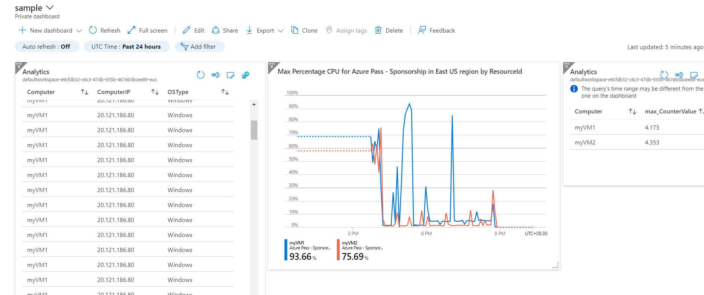

## Step: Adding the data to Dashboard

- To visualize the all collected data in one place, we can create one dashboard for that.
- On the left corner side of the Azure portal, click on the Menu option and select **Dashboard**
- Click on the **+ New dashboard** from the top menu and select Blank dashboard.
- Give the new name of dashboard and click on Done customizing.
- When you perform any operation in the portal there is an option **Pin to dashboard**. Simply click on that
  
- Select the existing Dashboard available or create the new one from here.
- After that click on **Pin**, the data then will be available on the dashboard.
  
