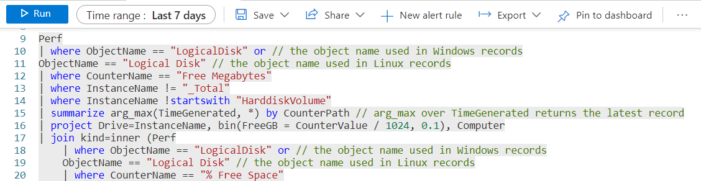
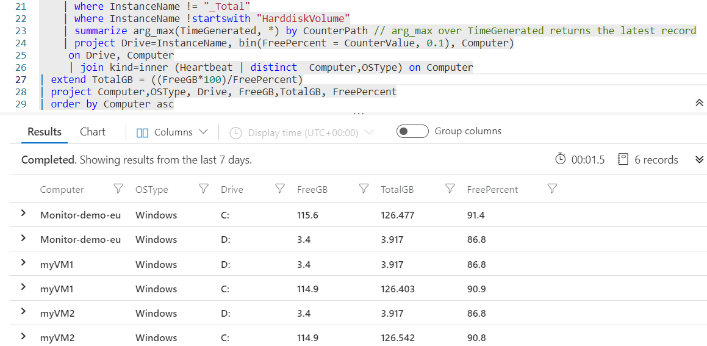

# Reduce Cost with Azure Virtual Machine

VM insights monitors the performance and health of the virtual machines, including their running processes and dependencies on other resources. This could be helpful in determining the ways to reduce the cost of Virtual Machines.

The cost of the virtual machine depends on various conditions:
- The size of virtual machine
- The region where the VM is deployed
- The operating system of the VM

Some ways to reduce the cost of Virtual Machine:
- Use Reserved Virtual Machine Instances
  - Azure Reserved VM Instances is a way of committing to a fixed number of Virtual Machines and sizes in Azure for a period of 1 or 3 years
- Azure Hybrid Benefits
  - Azure Hybrid Benefit is a licensing benefit that helps to significantly reduce the costs of running the workloads in the cloud, it can be done by using the on-premises Software Assurance-enabled Windows Server and SQL Server licenses on Azure. 
- Right-Size VMs
- Schedule VMs to Start/Stop Based on Usage

We will consider some situations for which we can reduce the cost associate to Azure Virtual Machines. For that you should have Vitual Machines deployed in your subscription.

## Step 1: Create the dependent resources

**Create Log Analytics Workspace**
- Click on **+ Create a resource** in the azure portal and search for **Log Analytics workspace** 
- Select the **+ Create**
- Provide the basic information:

| Setting | Value |
| -- | -- |
| **Subscription** | Select your active subscription |
| **Resource group** | Select the existing resource group or create new |
| **Name** | Sample-LogAnalytics-*selected_region* |
| **Region** | Based on requirement |

- Give the **Tags** to the resource as per requirement.
- Click on the **Review and Create** button. After validation passed **Create** the resource
- Wait for the deployment to complete
---
## Step 2: Connect the Virtual Machines to Log Analytics Workspace

- Navigate to the previously created **Log Analytics Workspace**
- Under **Workspace Data Sources** section, select **Virtual Machines**
- Search for the Virtual Machine in the Search tab, Open the Virtual Machine and then click on **Connect**
- Now, under **Settings** section, click on **Agents configuration**
- Go to **Windows performance counter** tab and click on **Add recommended counters**. Perform the same action on **Linux performance counter**
- Click on **Apply**
---
## Step 3: Perform some Log Queries

- Under **General** section, select **Logs**. Here you can type some Log Queries on which we can decide what action should be performed.
- Some scenarios we can consider such as *Maximum CPU utilization is less than 25, Maximum Memory utilization is less than 25, Free Disk Space is 90% of Total Disk Space*

### Log data for last **7 Days** of Virual Machine Performance. 

- Here the **Perf** is the performance of hardware components operating systems and applications. The ObjectName is the Name of the performance object, CounterName is the Name of the performance counter and InstanceName is the Name of the event instance.
- Here we are using the ObjectName as *Processor*: The Processor Object in the perfomance counter gives us details on how our processor that is driving our computer is being used and CounterName as *% Processor Time*: % Processor time is the percentage measure of how much time the processor spends on any particular process
- We are providing the minimum, average and maximum CPU utilization from last 7 days and Based on that we are filtering the result where the maximum CPU utilization is less than 25 percentage.

          Perf
          | where TimeGenerated > ago(7d)
          | where ObjectName == "Processor" and CounterName == "% Processor Time" and InstanceName == "_Total"
          | summarize MIN_CPU = min(CounterValue), AVG_CPU = avg(CounterValue), MAX_CPU = max(CounterValue) by Computer
          | join (Heartbeat) on Computer
          | project Computer,OSType,MIN_CPU,AVG_CPU,MAX_CPU
          | distinct Computer,OSType,MIN_CPU,AVG_CPU,MAX_CPU
          | where MAX_CPU < 25

- Here we are using the ObjectName as *% Committed Bytes in Use*: which displays the ratio of memory/committed bytes to memory/commit limit 
- We are providing the minimum, average, maximum Memory utilization from last 7 days and Based on that we are filtering the result where the maximum Memory utilization is less than 25 percentage.

        //For Windows:
         Perf
         | where TimeGenerated > ago(7d)
         | where CounterName == "% Committed Bytes In Use" 
         | summarize AVG_MEM = avg(CounterValue), MIN_MEM = min(CounterValue), MAX_MEM = max(CounterValue) by Computer
         | join (Heartbeat) on Computer
         | project Computer,OSType,MIN_MEM,AVG_MEM,MAX_MEM
         | distinct Computer,OSType,MIN_MEM,AVG_MEM,MAX_MEM
         | where MAX_MEM < 25
        
        //For Linux:
         Perf
         | where TimeGenerated > ago(7d)
         | where CounterName == "% Used Memory" 
         | summarize AVG_MEM = avg(CounterValue), MIN_MEM = min(CounterValue), MAX_MEM = max(CounterValue) by Computer
         | join (Heartbeat) on Computer
         | project Computer,OSType,MIN_MEM,AVG_MEM,MAX_MEM
         | distinct Computer,OSType,MIN_MEM,AVG_MEM,MAX_MEM
         | where MAX_MEM < 25

- Consolidated chart of Maximum CPU utilization and Maximum Memory utilization

          Perf
          | where TimeGenerated > ago(7d)
          | where ObjectName == "Processor" and CounterName == "% Processor Time" and InstanceName == "_Total"
          | summarize MIN_CPU = min(CounterValue), AVG_CPU = avg(CounterValue), MAX_CPU = max(CounterValue) by Computer
          | join (Heartbeat ) on Computer
          | join
          (
               Perf
              | where TimeGenerated > ago(7d)
              | where CounterName == "% Committed Bytes In Use" or CounterName =="% Used Memory"
              | summarize AVG_MEM = avg(CounterValue), MIN_MEM = min(CounterValue), MAX_MEM = max(CounterValue) by Computer
          ) on Computer
          | project Computer, OSType,MIN_CPU,AVG_CPU,MAX_CPU,MIN_MEM,AVG_MEM,MAX_MEM
          | where MAX_CPU < 25 and MAX_MEM < 25
   

---
### Log data for last **15 Days** of Virual Machine Performance.

- Here the **Perf** is the performance of hardware components operating systems and applications. The ObjectName is the Name of the performance object, CounterName is the Name of the performance counter and InstanceName is the Name of the event instance.
- Here we are using the ObjectName as *Processor*: The Processor Object in the perfomance counter gives us details on how our processor that is driving our computer is being used and CounterName as *% Processor Time*: % Processor time is the percentage measure of how much time the processor spends on any particular process
- We are providing the minimum, average and maximum CPU utilization from last 15 days and Based on that we are filtering the result where the maximum CPU utilization is less than 25 percentage.

  
          Perf
          | where TimeGenerated > ago(15d)
          | where ObjectName == "Processor" and CounterName == "% Processor Time" and InstanceName == "_Total"
          | summarize MIN_CPU = min(CounterValue), AVG_CPU = avg(CounterValue), MAX_CPU = max(CounterValue) by Computer
          | join (Heartbeat) on Computer
          | project Computer,OSType,MIN_CPU,AVG_CPU,MAX_CPU
          | distinct Computer,OSType,MIN_CPU,AVG_CPU,MAX_CPU
          | where MAX_CPU < 25

- Here we are using the ObjectName as *% Committed Bytes in Use*: which displays the ratio of memory/committed bytes to memory/commit limit
- We are providing the minimum, average, maximum Memory utilization from last 15 days and Based on that we are filtering the result where the maximum Memory utilization is less than 25 percentage.

        //For Windows:
         Perf
         | where TimeGenerated > ago(15d)
         | where CounterName == "% Committed Bytes In Use" 
         | summarize AVG_MEM = avg(CounterValue), MIN_MEM = min(CounterValue), MAX_MEM = max(CounterValue) by Computer
         | join (Heartbeat) on Computer
         | project Computer,OSType,MIN_MEM,AVG_MEM,MAX_MEM
         | distinct Computer,OSType,MIN_MEM,AVG_MEM,MAX_MEM
         | where MAX_MEM < 25
        
        //For Linux:
         Perf
         | where TimeGenerated > ago(15d)
         | where CounterName == "% Used Memory" 
         | summarize AVG_MEM = avg(CounterValue), MIN_MEM = min(CounterValue), MAX_MEM = max(CounterValue) by Computer
         | join (Heartbeat) on Computer
         | project Computer,OSType,MIN_MEM,AVG_MEM,MAX_MEM
         | distinct Computer,OSType,MIN_MEM,AVG_MEM,MAX_MEM
         | where MAX_MEM < 25

- Consolidated chart of Maximum CPU utilization and Maximum Memory utilization

          Perf
          | where TimeGenerated > ago(15d)
          | where ObjectName == "Processor" and CounterName == "% Processor Time" and InstanceName == "_Total"
          | summarize MIN_CPU = min(CounterValue), AVG_CPU = avg(CounterValue), MAX_CPU = max(CounterValue) by Computer
          | join (Heartbeat ) on Computer
          | join
          (
                Perf
                | where TimeGenerated > ago(15d)
                | where CounterName == "% Committed Bytes In Use" or CounterName =="% Used Memory"
                | summarize AVG_MEM = avg(CounterValue), MIN_MEM = min(CounterValue), MAX_MEM = max(CounterValue) by Computer
          ) on Computer
          | project Computer, OSType,MIN_CPU,AVG_CPU,MAX_CPU,MIN_MEM,AVG_MEM,MAX_MEM
          | where MAX_CPU < 25 and MAX_MEM < 25

---
### Log data for last **30 Days** of Virual Machine Performance.

- Here the **Perf** is the performance of hardware components operating systems and applications. The ObjectName is the Name of the performance object, CounterName is the Name of the performance counter and InstanceName is the Name of the event instance.
- Here we are using the ObjectName as *Processor*: The Processor Object in the perfomance counter gives us details on how our processor that is driving our computer is being used and CounterName as *% Processor Time*: % Processor time is the percentage measure of how much time the processor spends on any particular process
- We are providing the minimum, average and maximum CPU utilization from last 30 days and Based on that we are filtering the result where the maximum CPU utilization is less than 25 percentage.

          Perf
          | where TimeGenerated > ago(30d)
          | where ObjectName == "Processor" and CounterName == "% Processor Time" and InstanceName == "_Total"
          | summarize MIN_CPU = min(CounterValue), AVG_CPU = avg(CounterValue), MAX_CPU = max(CounterValue) by Computer
          | join (Heartbeat) on Computer
          | project Computer,OSType,MIN_CPU,AVG_CPU,MAX_CPU
          | distinct Computer,OSType,MIN_CPU,AVG_CPU,MAX_CPU
          | where MAX_CPU < 25

- Here we are using the ObjectName as *% Committed Bytes in Use*: which displays the ratio of memory/committed bytes to memory/commit limit
 - We are providing the minimum, average, maximum Memory utilization from last 30 days and Based on that we are filtering the result where the maximum Memory utilization is less than 25 percentage.

        //For Windows:
         Perf
         | where TimeGenerated > ago(30d)
         | where CounterName == "% Committed Bytes In Use" 
         | summarize AVG_MEM = avg(CounterValue), MIN_MEM = min(CounterValue), MAX_MEM = max(CounterValue) by Computer
         | join (Heartbeat) on Computer
         | project Computer,OSType,MIN_MEM,AVG_MEM,MAX_MEM
         | distinct Computer,OSType,MIN_MEM,AVG_MEM,MAX_MEM
         | where MAX_MEM < 25
        
        //For Linux:
         Perf
         | where TimeGenerated > ago(30d)
         | where CounterName == "% Used Memory" 
         | summarize AVG_MEM = avg(CounterValue), MIN_MEM = min(CounterValue), MAX_MEM = max(CounterValue) by Computer
         | join (Heartbeat) on Computer
         | project Computer,OSType,MIN_MEM,AVG_MEM,MAX_MEM
         | distinct Computer,OSType,MIN_MEM,AVG_MEM,MAX_MEM
         | where MAX_MEM < 25

- Consolidated chart of Maximum CPU utilization and Maximum Memory utilization

          Perf
          | where TimeGenerated > ago(30d)
          | where ObjectName == "Processor" and CounterName == "% Processor Time" and InstanceName == "_Total"
          | summarize MIN_CPU = min(CounterValue), AVG_CPU = avg(CounterValue), MAX_CPU = max(CounterValue) by Computer
          | join (Heartbeat ) on Computer
          | join
          (
                Perf
                | where TimeGenerated > ago(30d)
                | where CounterName == "% Committed Bytes In Use" or CounterName =="% Used Memory"
                | summarize AVG_MEM = avg(CounterValue), MIN_MEM = min(CounterValue), MAX_MEM = max(CounterValue) by Computer
          ) on Computer
          | project Computer, OSType,MIN_CPU,AVG_CPU,MAX_CPU,MIN_MEM,AVG_MEM,MAX_MEM
          | where MAX_CPU < 25 and MAX_MEM < 25

- Free Disk Space is 90% of Total Disk Space

          Perf
          | where ObjectName == "LogicalDisk" or // the object name used in Windows records
          ObjectName == "Logical Disk" // the object name used in Linux records
          | where CounterName == "Free Megabytes"
          | where InstanceName != "_Total"
          | where InstanceName !startswith "HarddiskVolume"
          | summarize arg_max(TimeGenerated, *) by CounterPath // arg_max over TimeGenerated returns the latest record
          | project Drive=InstanceName, bin(FreeGB = CounterValue / 1024, 0.1), Computer
          | join kind=inner (Perf
              | where ObjectName == "LogicalDisk" or // the object name used in Windows records
              ObjectName == "Logical Disk" // the object name used in Linux records
              | where CounterName == "% Free Space"
              | where InstanceName != "_Total"
              | where InstanceName !startswith "HarddiskVolume"
              | summarize arg_max(TimeGenerated, *) by CounterPath // arg_max over TimeGenerated returns the latest record
              | project Drive=InstanceName, bin(FreePercent = CounterValue, 0.1), Computer)
               on Drive, Computer
               | join kind=inner (Heartbeat | distinct  Computer,OSType) on Computer
          | extend TotalGB = ((FreeGB*100)/FreePercent)
          | project Computer,OSType, Drive, FreeGB,TotalGB, FreePercent
          | order by Computer asc
          | where FreePercent > 90
          

---

Extra queries

CPU utilization of virtual machine

     
    Perf
    | where TimeGenerated > ago(15d)
    | where ObjectName == "Processor" and CounterName == "% Processor Time" and InstanceName == "_Total"
    | summarize MIN_CPU = min(CounterValue), AVG_CPU = avg(CounterValue), MAX_CPU = max(CounterValue) by Computer
    | join (Heartbeat | distinct Computer,OSType) on Computer
    | project Computer,OSType,MIN_CPU,AVG_CPU,MAX_CPU
    | where MAX_CPU < 25

    
---

Memory utilization of virtual machine

      Perf
      | where TimeGenerated > ago(30d)
      | where CounterName == "% Committed Bytes In Use" 
      | summarize AVG_MEM = avg(CounterValue), MIN_MEM = min(CounterValue), MAX_MEM = max(CounterValue) by Computer
      | join (Heartbeat | distinct Computer,OSType) on Computer
      | project Computer,OSType,MIN_MEM,AVG_MEM,MAX_MEM
      | where MAX_MEM < 25
      
---

 

