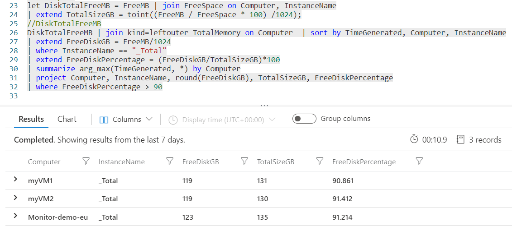
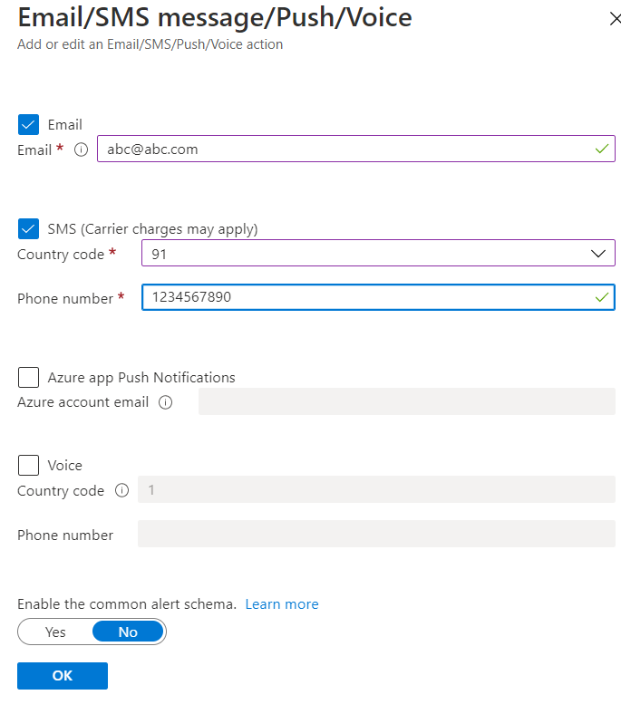
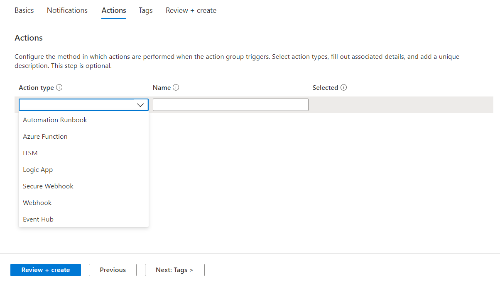

# Reduce Cost with Azure Virtual Machine

VM insights monitors the performance and health of the virtual machines, including their running processes and dependencies on other resources. This could be helpful in determining the ways to reduce the cost of Virtual Machines.

The cost of the virtual machine depends on various conditions:
- The size of virtual machine
- The region where the VM is deployed
- The operating system of the VM

We will consider some situations for which we can reduce the cost associate to Azure Virtual Machines. For that you should have Vitual Machines deployed in your subscription.

## Step 1: Create the dependent resources

**Create Log Analytics Workspace**
- Click on **+ Create a resource** in the azure portal and search for **Log Analytics workspace** 
- Select the **+ Create**
- Provide the basic information:

| Setting | Value |
| -- | -- |
| **Subscription** | Select your active subscription |
| **Resource group** | Select the existing resource group or create new |
| **Name** | Sample-LogAnalytics-*selected_region* |
| **Region** | Based on requirement |

- Give the **Tags** to the resource as per requirement.
- Click on the **Review and Create** button. After validation passed **Create** the resource
- Wait for the deployment to complete
---
## Step 2: Connect the Virtual Machines to Log Analytics Workspace

- Navigate to the previously created **Log Analytics Workspace**
- Under **Workspace Data Sources** section, select **Virtual Machines**
- Search for the Virtual Machine in the Search tab, Open the Virtual Machine and then click on **Connect**
- Now, under **Settings** section, click on **Agents configuration**
- Go to **Windows performance counter** tab and click on **Add recommended counters**. Perform the same action on **Linux performance counter**
- Click on **Apply**
---
## Step 3: Perform some Log Queries

- Under **General** section, select **Logs**. Here you can type some Log Queries on which we can decide what action should be performed.
- Some scenarios we can consider such as *Maximum CPU utilization is less than 25, Maximum Memory utilization is less than 25, Free Disk Space is 90% of Total Disk Space*

### Log data for last **7 Days** of Virual Machine Performance. 

- Here the **Perf** is the performance of hardware components operating systems and applications. The ObjectName is the Name of the performance object, CounterName is the Name of the performance counter and InstanceName is the Name of the event instance.
- Here we are using the ObjectName as *Processor*: The Processor Object in the perfomance counter gives us details on how our processor that is driving our computer is being used and CounterName as *% Processor Time*: % Processor time is the percentage measure of how much time the processor spends on any particular process
- We are providing the minimum, average and maximum CPU utilization from last 7 days and Based on that we are filtering the result where the maximum CPU utilization is less than 25 percentage.

        Perf
        | where TimeGenerated > ago(7d)
        | where ObjectName == "Processor" and CounterName == "% Processor Time" and InstanceName == "_Total"
        | summarize MIN_CPU = min(CounterValue), AVG_CPU = avg(CounterValue), MAX_CPU = max(CounterValue) by Computer
        | where MAX_CPU < 25

- Here we are using the ObjectName as *% Committed Bytes in Use*: which displays the ratio of memory/committed bytes to memory/commit limit 
- We are providing the minimum, average, maximum Memory utilization from last 7 days and Based on that we are filtering the result where the maximum Memory utilization is less than 25 percentage.

        //For Windows:
        Perf
        | where TimeGenerated > ago(7d)
        | where CounterName == "% Committed Bytes In Use" 
        | summarize AVG_MEM = avg(CounterValue), MIN_MEM = min(CounterValue), MAX_MEM = max(CounterValue) by Computer
        | where MAX_MEM < 25
        
        //For Linux:
        Perf
        | where TimeGenerated > ago(7d)
        | where CounterName == "% Used Memory" 
        | summarize AVG_MEM = avg(CounterValue), MIN_MEM = min(CounterValue), MAX_MEM = max(CounterValue) by Computer
        | where MAX_MEM < 25

- Consolidated chart of Maximum CPU utilization and Maximum Memory utilization

        Perf
        | where TimeGenerated > ago(7d)
        | where ObjectName == "Processor" and CounterName == "% Processor Time" and InstanceName == "_Total"
        | summarize MIN_CPU = min(CounterValue), AVG_CPU = avg(CounterValue), MAX_CPU = max(CounterValue) by Computer
        | join
            (
                Perf
                | where TimeGenerated > ago(7d)
                | where CounterName == "% Committed Bytes In Use" or CounterName =="% Used Memory"
                | summarize AVG_MEM = avg(CounterValue), MIN_MEM = min(CounterValue), MAX_MEM = max(CounterValue) by Computer
        ) on Computer
        | join (Heartbeat) on Computer
        | project Computer, OSType,MIN_CPU,AVG_CPU,MAX_CPU,MIN_MEM,AVG_MEM,MAX_MEM
        | distinct Computer, OSType,MIN_CPU,AVG_CPU,MAX_CPU,MIN_MEM,AVG_MEM,MAX_MEM
        | where MAX_CPU < 25 and MAX_MEM < 25

---
### Log data for last **15 Days** of Virual Machine Performance.

- Here the **Perf** is the performance of hardware components operating systems and applications. The ObjectName is the Name of the performance object, CounterName is the Name of the performance counter and InstanceName is the Name of the event instance.
- Here we are using the ObjectName as *Processor*: The Processor Object in the perfomance counter gives us details on how our processor that is driving our computer is being used and CounterName as *% Processor Time*: % Processor time is the percentage measure of how much time the processor spends on any particular process
- We are providing the minimum, average and maximum CPU utilization from last 15 days and Based on that we are filtering the result where the maximum CPU utilization is less than 25 percentage.

  
        Perf
        | where TimeGenerated > ago(15d)
        | where ObjectName == "Processor" and CounterName == "% Processor Time" and InstanceName == "_Total"
        | summarize MIN_CPU = min(CounterValue), AVG_CPU = avg(CounterValue), MAX_CPU = max(CounterValue) by Computer
        | where MAX_CPU < 25

- Here we are using the ObjectName as *% Committed Bytes in Use*: which displays the ratio of memory/committed bytes to memory/commit limit
- We are providing the minimum, average, maximum Memory utilization from last 15 days and Based on that we are filtering the result where the maximum Memory utilization is less than 25 percentage.

        //For Windows:
        Perf
        | where TimeGenerated > ago(15d)
        | where CounterName == "% Committed Bytes In Use" 
        | summarize AVG_MEM = avg(CounterValue), MIN_MEM = min(CounterValue), MAX_MEM = max(CounterValue) by Computer
        | where MAX_MEM < 25
        
        //For Linux:
        Perf
        | where TimeGenerated > ago(15d)
        | where CounterName == "% Used Memory" 
        | summarize AVG_MEM = avg(CounterValue), MIN_MEM = min(CounterValue), MAX_MEM = max(CounterValue) by Computer
        | where MAX_MEM < 25

- Consolidated chart of Maximum CPU utilization and Maximum Memory utilization

        Perf
        | where TimeGenerated > ago(15d)
        | where ObjectName == "Processor" and CounterName == "% Processor Time" and InstanceName == "_Total"
        | summarize MIN_CPU = min(CounterValue), AVG_CPU = avg(CounterValue), MAX_CPU = max(CounterValue) by Computer
        | join
            (
                Perf
                | where TimeGenerated > ago(15d)
                | where CounterName == "% Committed Bytes In Use" or CounterName =="% Used Memory"
                | summarize AVG_MEM = avg(CounterValue), MIN_MEM = min(CounterValue), MAX_MEM = max(CounterValue) by Computer
        ) on Computer
        | join (Heartbeat) on Computer
        | project Computer, OSType,MIN_CPU,AVG_CPU,MAX_CPU,MIN_MEM,AVG_MEM,MAX_MEM
        | distinct Computer, OSType,MIN_CPU,AVG_CPU,MAX_CPU,MIN_MEM,AVG_MEM,MAX_MEM
        | where MAX_CPU < 25 and MAX_MEM < 25

---
### Log data for last **30 Days** of Virual Machine Performance.

- Here the **Perf** is the performance of hardware components operating systems and applications. The ObjectName is the Name of the performance object, CounterName is the Name of the performance counter and InstanceName is the Name of the event instance.
- Here we are using the ObjectName as *Processor*: The Processor Object in the perfomance counter gives us details on how our processor that is driving our computer is being used and CounterName as *% Processor Time*: % Processor time is the percentage measure of how much time the processor spends on any particular process
- We are providing the minimum, average and maximum CPU utilization from last 30 days and Based on that we are filtering the result where the maximum CPU utilization is less than 25 percentage.

        Perf
        | where TimeGenerated > ago(30d)
        | where ObjectName == "Processor" and CounterName == "% Processor Time" and InstanceName == "_Total"
        | summarize MIN_CPU = min(CounterValue), AVG_CPU = avg(CounterValue), MAX_CPU = max(CounterValue) by Computer
        | where MAX_CPU < 25

- Here we are using the ObjectName as *% Committed Bytes in Use*: which displays the ratio of memory/committed bytes to memory/commit limit
 - We are providing the minimum, average, maximum Memory utilization from last 30 days and Based on that we are filtering the result where the maximum Memory utilization is less than 25 percentage.

        //For Windows:
        Perf
        | where TimeGenerated > ago(30d)
        | where CounterName == "% Committed Bytes In Use" 
        | summarize AVG_MEM = avg(CounterValue), MIN_MEM = min(CounterValue), MAX_MEM = max(CounterValue) by Computer
        | where MAX_MEM < 25
        
        //For Linux:
        Perf
        | where TimeGenerated > ago(30d)
        | where CounterName == "% Used Memory" 
        | summarize AVG_MEM = avg(CounterValue), MIN_MEM = min(CounterValue), MAX_MEM = max(CounterValue) by Computer
        | where MAX_MEM < 25

- Consolidated chart of Maximum CPU utilization and Maximum Memory utilization

        Perf
        | where TimeGenerated > ago(30d)
        | where ObjectName == "Processor" and CounterName == "% Processor Time" and InstanceName == "_Total"
        | summarize MIN_CPU = min(CounterValue), AVG_CPU = avg(CounterValue), MAX_CPU = max(CounterValue) by Computer
        | join
            (
                Perf
                | where TimeGenerated > ago(30d)
                | where CounterName == "% Committed Bytes In Use" or CounterName =="% Used Memory"
                | summarize AVG_MEM = avg(CounterValue), MIN_MEM = min(CounterValue), MAX_MEM = max(CounterValue) by Computer
        ) on Computer
        | join (Heartbeat) on Computer
        | project Computer, OSType,MIN_CPU,AVG_CPU,MAX_CPU,MIN_MEM,AVG_MEM,MAX_MEM
        | distinct Computer, OSType,MIN_CPU,AVG_CPU,MAX_CPU,MIN_MEM,AVG_MEM,MAX_MEM
        | where MAX_CPU < 25 and MAX_MEM < 25

- Free Disk Space is 90% of Total Disk Space

        let FreeMemory = Perf
        | where (ObjectName == "Memory" and CounterName contains "Available M")
        | summarize FreeMemory = (avg(CounterValue)) by bin(TimeGenerated, 1h), Computer, InstanceName
        | sort by TimeGenerated, Computer desc;
        //FreeMemory
        let UsedMemory = Perf
        | where (ObjectName == "Memory" and CounterName == "Committed Bytes")
        | summarize UsedMemory = (avg(CounterValue)) by bin(TimeGenerated, 1h), Computer, InstanceName
        | sort by TimeGenerated, Computer desc;
        //UsedMemory
        let TotalMemory = FreeMemory | join UsedMemory on Computer, InstanceName;
        //TotalMemory
        let FreeMB = Perf
        | where CounterName == "Free Megabytes"
        | summarize FreeMB = (avg(CounterValue)) by bin(TimeGenerated, 1h), Computer, InstanceName
        | sort by TimeGenerated, Computer desc;
        //FreeMB
        let FreeSpace = Perf
        | where CounterName == "% Free Space" and InstanceName !contains "DPM"
        | summarize FreeSpace = (avg(CounterValue)) by bin(TimeGenerated, 1h), Computer, InstanceName
        | sort by TimeGenerated, Computer desc;
        //FreeSpace
        let DiskTotalFreeMB = FreeMB | join FreeSpace on Computer, InstanceName
        | extend TotalSizeGB = toint((FreeMB / FreeSpace * 100) /1024);
        //DiskTotalFreeMB
        DiskTotalFreeMB | join kind=leftouter TotalMemory on Computer  | sort by TimeGenerated, Computer, InstanceName
        | extend FreeDiskGB = FreeMB/1024
        | where InstanceName == "_Total"
        | extend FreeDiskPercentage = (FreeDiskGB/TotalSizeGB)*100
        | summarize arg_max(TimeGenerated, *) by Computer
        | project Computer, InstanceName, round(FreeDiskGB), TotalSizeGB, FreeDiskPercentage
        | where FreeDiskPercentage > 90

---
## Step 4: Resize the Virtual Machine

- Navigate to the Virtual Machine that we found from the log queries
- First **Stop** the Virtual Machine
  
- Under **Settings** section, go to **Size**
- Select the size of the Virtual Machine, which has less number of vCPUs, RAM so the cost should be less compared to others.
> Note: If the virtual machine is in running state, changing the size will cause it to be restarted.
- Click on **Resize**, once you selected the desired size for virtual machine
  

---
## Step 5: Reduce the size of OS Disk

---
## Step 6: Create the Metrics chart from Azure Monitor

- To monitor the virtual machines individualy we can use Metrics chart
- Navigate to the Azure monitor, click on **Metrics**
- First it will ask for Select a scope, you can select only one resource here
- After selecting the resource, select the required Metric and aggregation
- You can pin this metric chart to dashboard by clicking **Pin to dashboard** from the top menu
  

---
## Step 7: Adding the data to Dashboard

- To visualize the all collected data in one place, we can create one dashboard for that.
- On the left corner side of the Azure portal, click on the Menu option and select **Dashboard**
- Click on the **+ New dashboard** from the top menu and select Blank dashboard.
- Give the new name of dashboard and click on Done customizing.
- When you perform any operation in the portal there is an option **Pin to dashboard**. Simply click on that
  
- Select the existing Dashboard available or create the new one from here.
- After that click on **Pin**, the data then will be available on the dashboard.
  

---
## Step 8: Add the alerts 

The users should get notification when some conditions met like when there is a resource which is not properly utilized for last some days, the cost can be reduced for such resouces.

- When writing the log queries there is an option for the **+ New alert rule** in the top menu. This will be based on that specific query.
- Click on that, the condition should be already there define the logic in that condition
- Now click on the **Add action group**, in that we can add the email address or SMS for the required user which will be notified 
- The steps are shown below:

- Click on the condition so that you can define the logic behind that condition

- After Defining the logic click on **Done**

- An action group is a collection of notification preferences defined in the Azure. To add the action group click on **Add action group**

- Provide the basic details on the **Basics** tab

- On the notification tab, select the notification type as **Email/SMS message/Push/Voice**

- Enter the **Email** and **Phone number** of the user who you want to receive the notification when the alert is fired
> Note: You have to enter the valid Email and Phone number

- When the alert is fired, it should perform some action. We can define those action type on the **Actions** tab

- Give the name of alert, it's resource group and severity. At last click on **Create alert rule**

---

- Now the **Alert rule** has been added. In some scenario during planned maintenance, you want to suppress the notifications of the alert. Here we can use **Action rule**

- Go to the **Alerts** page on **Monitor** and click on **Action rules**. After that select **+ Create**

- New window will appear. Select the **Scope** on which you want to apply the action rule. You can select the **Suppression** or **Action group**

- You can select for what time range the alert should suppressed. There are options like *At scheduled time* or *With a recurrence*

- After configuring all the details **Create**

