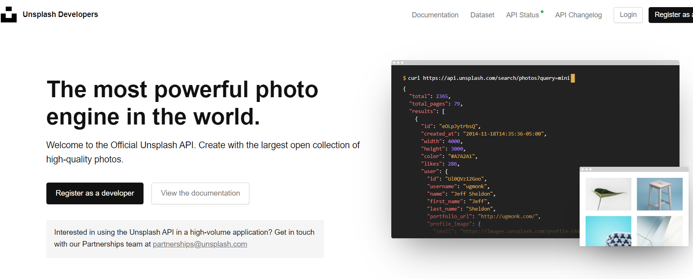
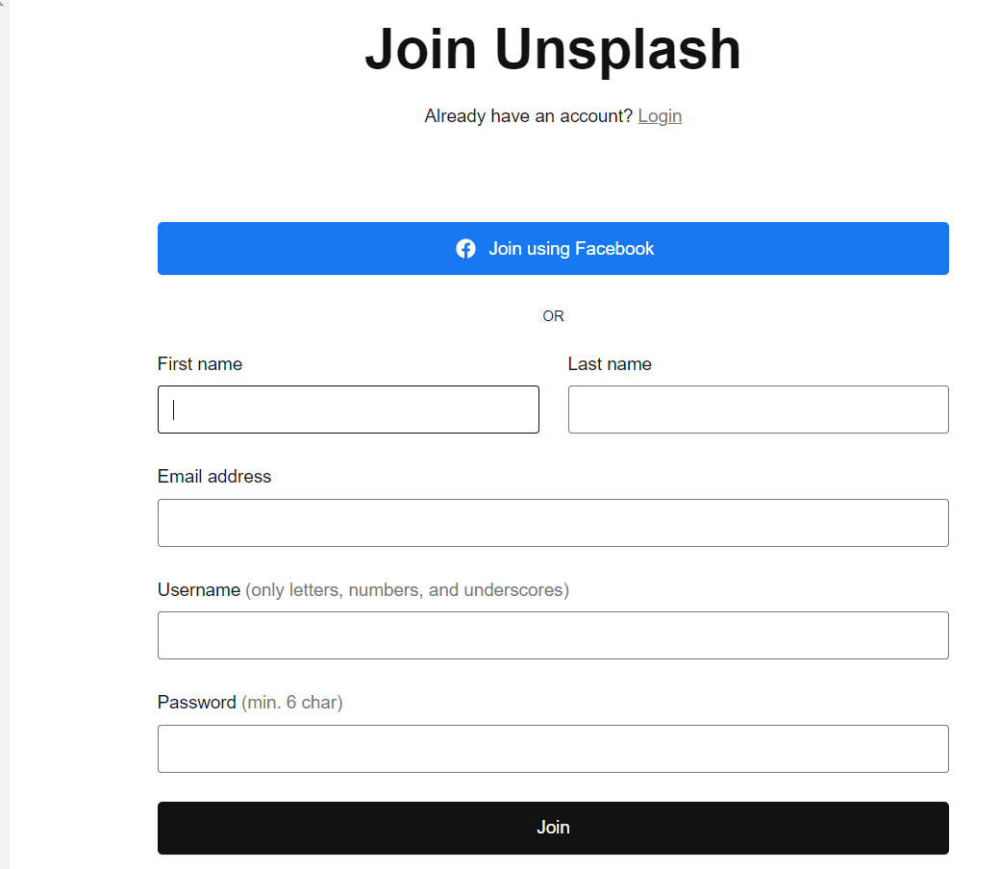
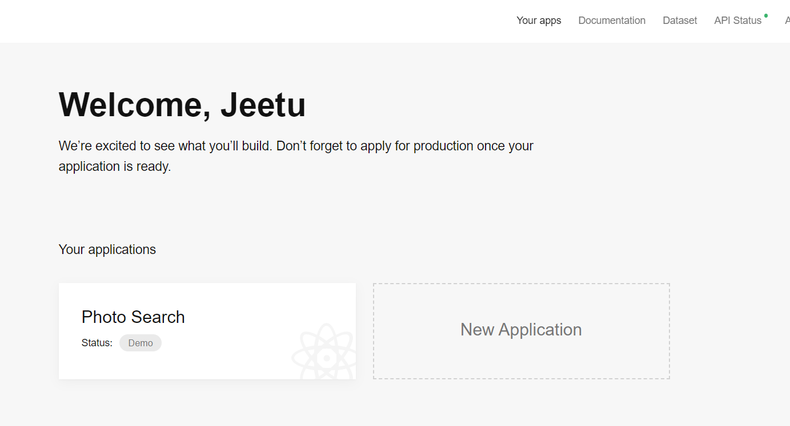
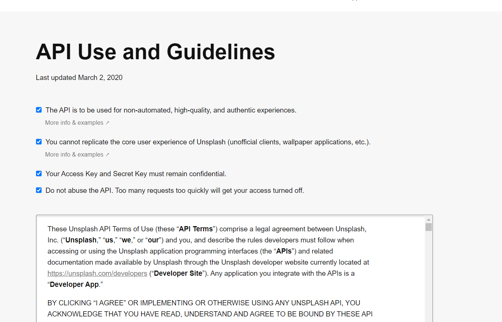
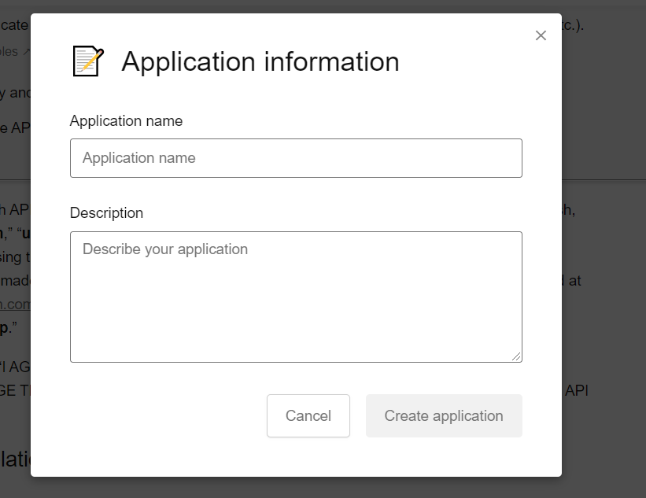
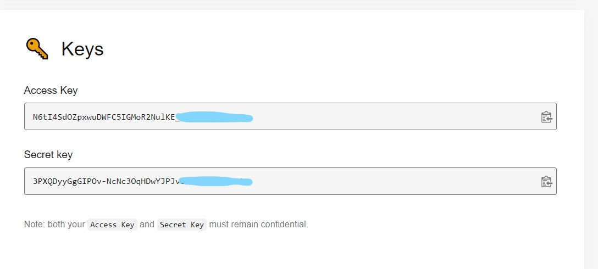
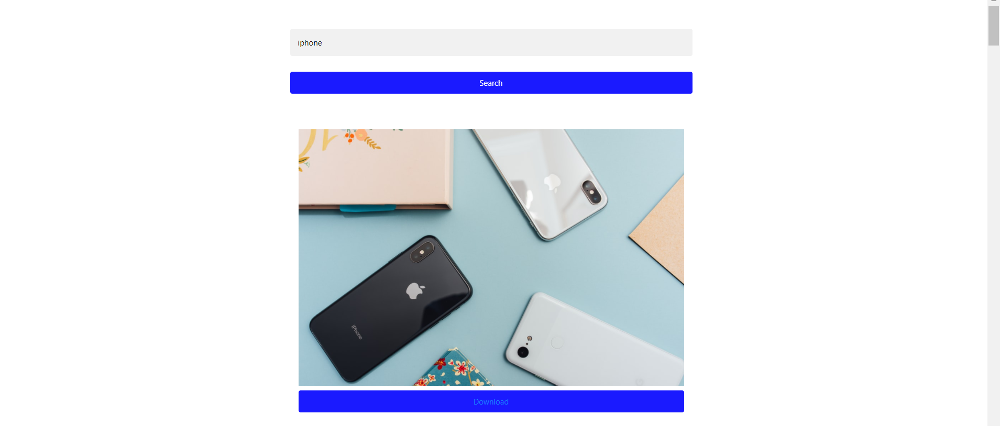

# Search Photos using Unsplash API

We can get the Images from Unsplash server to our website by calling the unsplash photo search API.

# Steps for calling unsplash Photo Search API 
<ul>
  <li>Go to website <a href="https://unsplash.com/developers">Unsplash Developers</a></li>
  <li>Here click on <b>Register as a Developer</b></li>
  
  <li>On the new window provide basic details like <b>First name, Last name, Email address, Username</b> and <b>Password</b></li>
  
  
  
  <li>After clicking on <b>Join</b>, you will have to create one application.</li>
  
  
   
  
  <li>Accept all the <b>Guidelines</b></li>
  
   
  
  <li>Provide the application name and what does the application do.</li>
  
   
  
  <li>Once the creation is done, you will get your <b>Access Key</b> and <b>Secret Key</b>. Copy the <b>Access Key</b>, you will use this as <b>Client Id</b></li>
  
  

<li>Use this URL: "https: //api.unsplash.com /search/photos/?client_id="+ clientId+"&query="+query (Enter the Access key as Client Id)</li>

<li>You can use this Sample Code</li>
</ul>
    
    <!DOCTYPE html>
    <html lang="en">
    <head>
    <meta charset="UTF-8">
    <meta http-equiv="X-UA-Compatible" content="IE=edge">
    <meta name="viewport" content="width=device-width, initial-scale=1.0">
    <title>Photo Search</title>
    <link rel="stylesheet" href="https://www.w3schools.com/w3css/4/w3.css">
    <link rel="stylesheet" href="https://fonts.googleapis.com/css?family=Lato">
    <link rel="stylesheet" href="https://cdnjs.cloudflare.com/ajax/libs/font-awesome/4.7.0/css/font-awesome.min.css">
    <link rel="stylesheet" href="https://maxcdn.bootstrapcdn.com/bootstrap/4.5.2/css/bootstrap.min.css">
    </head>

    

    <body>

        

        <input type="text" id="search" placeholder="Search Photos">
        <button onclick="SearchPhotos()">Search</button>
        

        

        

    </body>
    
    

    </html>

The unslash image search API will provide the following output:
 

