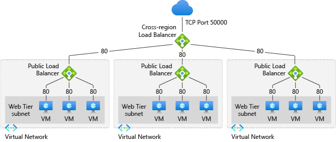

# Cross Region Azure Load Balancer

<b>Use-Case Scenario:</b> If the region fails, then the taffic should be routed to the closest regional load balancer which must be healthy. We can use Cross-Region Load Balancer.

<b>Creating Load Balancer in one region</b> 

Follow this link for reference: <a href="https://docs.microsoft.com/en-in/azure/load-balancer/quickstart-load-balancer-standard-public-portal?tabs=option-1-create-load-balancer-standard">Link</a>

<b>Step 1:</b> Create a <b>Virtual Network</b>
<ul>
  <li>Open the Azure Portal</li>
  <li>Select the <b>＋Create a resource</b> button, search for <b>Virtual Network</b>, and create with the following settings:</li>
  <ul>
    <li><b>Subscription</b> : Select your Azure Subscription</li>
    <li><b>Resource Group</b> : Choose or create a resource group</li>
    <li><b>Name</b> : Enter a unique name</li>
    <li><b>Region</b> : Choose any available region that is closest to you</li>
  </ul>
  <li>In the Next tab: IP Addresses, enter the following details</li>
  <ul>
    <li><b>IPv4 address space</b> : Enter 10.1.0.0/16</li>
    <li>Click on <b>Add Subnet</b>, enter <b>Name</b> : myBackendSubnet and <b>Subnet address range</b> : 10.1.0.0/24</li>
    <li>Click on <b>Add</b></li>
  </ul>
  <li>Go to the <b>Security</b> tab and enable the BastionHost with the following details</li>
  <ul>
    <li><b>Bastion name</b> : myBastionHost</li>
    <li><b>AzureBastionSubnet address space</b> : 10.1.1.0/27</li>
    <li><b>Public IP Address</b>: Select <b>Create new</b>, enter <b>name</b>: myBastionIP and select <b>Ok</b></li>
  </ul>
  <li>Click on the <b>Review and Create</b> button. After validation passed <b>Create</b> the resource </li>
  <li>Wait for the deployment to complete</li>
 </ul>
 
 
 
 <b>Step 2:</b> Create a NAT Gateway
 
 NAT Gateway is for outbound internet access for resources in the virtual network
 
 <ul>
  <li>Select the <b>＋Create a resource</b> button, search for <b>NAT Gateway</b>, and create with the following settings:</li>
  <ul>
    <li><b>Subscription</b> : Select your Azure Subscription</li>
    <li><b>Resource Group</b> : Choose or create a resource group</li>
    <li><b>NAT Gateway Name</b> : Enter a unique name</li>
    <li><b>Region</b> : Choose any available region that is closest to you</li>
    <li><b>Availability zone</b> : None</li>
    <li><b>Idle timeout (minutes)</b> : 15</li>
  </ul>
  <li>Go to the next tab <b>Outbound IP</b> and select <b>Create a new public IP address</b></li>
  <ul>
    <li>Enter <b>Name</b> : myNATGatewayIP and select <b>Ok</b></li>
  </ul>
  <li>Go to the next tab <b>Subnet</b></li>
  <ul>
    <li>In the <b>Virtual network</b>, select the virtual network that you created earlier</li>
    <li>Under the <b>Subnet name</b> select <b>myBackendSubnet</b></li>
  </ul>
  <li>Click on the <b>Review and Create</b> button. After validation passed <b>Create</b> the resource </li>
  <li>Wait for the deployment to complete</li>
 </ul>
 
 
 
 <b>Step 2:</b> Create a Load Balancer
 
 Load balancing will evenly distributes the load (incoming network traffic) across a group of backend resources or servers.
 
 <ul>
  <li><li>Select the <b>＋Create a resource</b> button, search for <b>Load Balancer</b>, and create with the following settings:</li>
  <ul>
    <li><b>Subscription</b> : Select your Azure Subscription</li>
    <li><b>Resource Group</b> : Choose or create a resource group</li>
    <li><b>Name</b> : Enter a unique name</li>
    <li><b>Region</b> : Choose any available region that is closest to you</li>
    <li><b>SKU</b> : Standard</li>
    <li><b>Type</b> : Public</li>
    <li><b>Tier</b> : Regional</li>
  </ul>
  <li>Go to the next tab <b>Frontend IP configuration</b></li>
  <ul>
    <li>Click on <b>+Add a Frontend IP configuration</b></li>
    <li><b>Name</b> : LoadBalancerFrontend </li>
    <li><b>IP version</b> : IPv4</li>
    <li><b>IP type</b> : IP address</li>
    <li>Select <b>Create new</b> in the <b>Public IP address</b>
 
 
 
 
 
 
 
 
 
 <b>Step 2:</b> Create a Virual Machine
 
 
 
  
