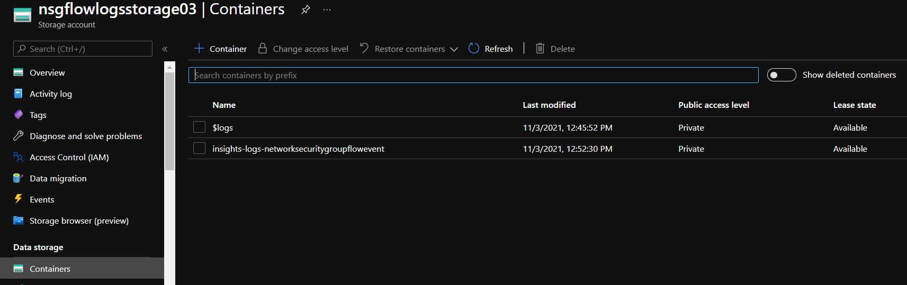
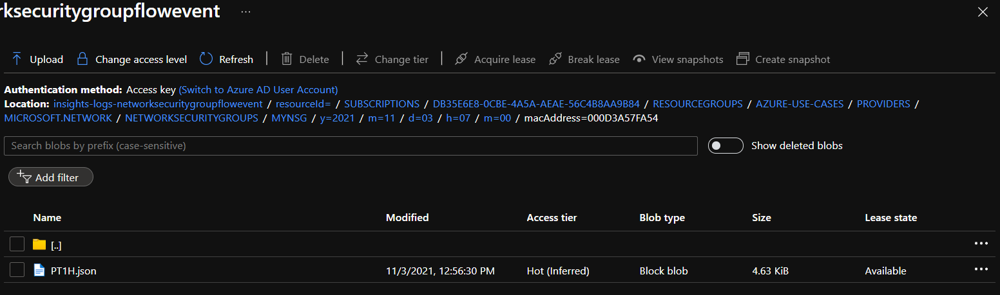
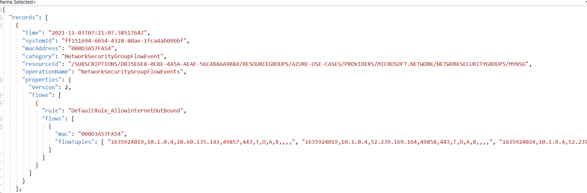
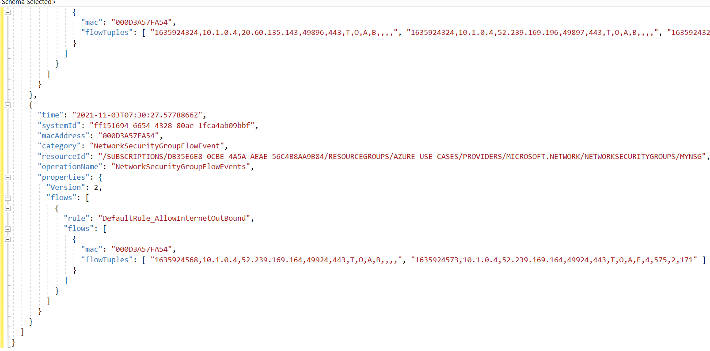

# Using network watcher's NSG flow log capability, enable a traffic log for NSG.md

With the help of Network's Watcher NSG flow log capability, we can log the network traffic that flows through NSG. The NSG enables to filter inbound and outbound traffic of Virtual Machine(VM)

<b>Step 1:</b> Create a VM

<ul>
  <li>Go to Azure Portal</li>
  <li>Select the <b>＋Create a resource</b> button, search for <b>Virtual Machine</b>, and create with the following settings:</li>
  <ul>
    <li><b>Subscription</b> : Select your Azure Subscription</li>
    <li><b>Resource Group</b> : Choose or create a resource group</li>
    <li><b>Name</b> : myVM1</li>
    <li><b>Region</b> : East US</li>
    <li><b>Availability Options</b> : No infrastructure redundancy required</li>
    <li><b>Image</b> : Windows Server 2019 Datacenter - Gen1</li>
    <li><b>Azure Spot instance</b> : Unchecked</li>
    <li><b>Size</b> : Leave default</li>
    <li><b>Username</b> : Enter the username as per your wish</li>
    <li><b>Password</b> : Enter the password</li>
    <li><b>Confirm Password</b> : Enter the same password</li>
  </ul>
  <li>Leave the rest of the setting as default</li>
 
  <li>Click on the <b>Review and Create</b> button. After validation passed <b>Create</b> the resource </li>
  <li>Wait for the deployment to complete</li>
 </ul>
 
 
 <b>Step 2:</b> Register the insights provider
 
 <ul>
  <li>In the Azure portal, to go your active subscription</li>
  <li>Under the Resource Provider, search for microsoft.insights and make sure it is registered, if not click on register.</li>
 </ul>

<b>Step 3:</b> Create a storage account

We need the storage account for storing NSG flow log data, follow these steps for creation of storage account

<ul>
  <li>Select the <b>＋Create a resource</b> button, search for <b>Storage account</b>, and create with the following settings:</li>
  <ul>
    <li><b>Subscription</b> : Select your Azure Subscription</li>
    <li><b>Resource Group</b> : Choose or create a resource group</li>
    <li><b>Name</b> : nsgflowlogsstorage03</li>
    <li><b>Region</b> : East US(Same region as the NSG)</li>
    <li><b>Performance</b> : Standard</li>
    <li><b>Redundancy</b> : Locally-redundant storage(LRS)</li>
  </ul>
  <li>Rest of the setting leave as default</li>
  <li>Click on the <b>Review and Create</b> button. After validation passed <b>Create</b> the resource </li>
  <li>Wait for the deployment to complete</li>
 </ul>

 <b>Step 4:</b> Create NSG Flow log
 
 <ul>
  <li>Go to the Azure portal and search for <b>Network Watcher</b></li>
  <li>Under Logs select <b>NSG flow logs</b> and click on create</li>
  <li>Provide the details as shown in the below picture</li>

  
  
  <li>Click on the <b>Review and Create</b> button. Wait for the deployment to complete</li>
 </ul>
 
You will see the see the NSG flow log with active status in the panel

In the Azure Portal, go to the storage account that you created <i>nsgflowlogsstorage03</i>. Under the <b>Data storage</b> go to <b>Containers</b> and click on the insights-logs-networksecuritygroupflowevent container.

In the container, navigate to the last folder until you will find PT1H.json file. Click on the file and download the file.

Open the downloaded file, you will see the data in the JSON format for each flow of NSG

The value in the mac is the MAC address of the network interface. The comma seperated present in the flowTuples is:

<ul>
  <li><b>1635924568</b> - Time stamp(when the flow occured in UNIX EPOCH format)</li>
  <li><b>10.1.0.4</b> - Source IP address</li>
  <li><b>52.239.169.164</b> - Destination IP address</li>
  <li><b>49924</b> - Source port</li>
  <li><b>443</b> - Destination port</li>
  <li><b>T</b> - Protocol (TCP (T) or UDP (U))</li>
  <li><b>O</b> - Direction (inbound (I) or outbound (O)</li>
  <li><b>A</b> - Action (allowed (A) or denied (D))</li>
  <li><b>B</b> - Flow State (Version 2 Only)(B-Begin, C-Continuing, E-End)</li>
  <li><b>4</b> - Packets sent - Source to destination (Version 2 Only)</li>
  <li><b>575</b> - Bytes sent - Source to destination (Version 2 Only)</li>
  <li><b>2</b> - Packets sent - Destination to source (Version 2 Only)</li>
  <li><b>171</b> - Bytes sent - Destination to source (Version 2 Only)</li>
