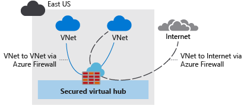

# Secure your virtual hub using Azure Firewall Manager

For reference: https://docs.microsoft.com/en-in/azure/firewall-manager/secure-cloud-network?WT.mc_id=APC-FirewallManager

With the help of Azure Firewall Manager, we can create secured virtual hubs which will secured the cloud network traffic.

<h3>Create two virtual networks that contains servers in them and those will be protected by firewall</h3>

<b>Steps:</b>

<ul>
  <li>Open the Azure Portal</li>
  <li>Select the <b>＋Create a resource</b> button, search for <b>Virtual Network</b>, and create with the following settings:</li>
  <ul>
    <li><b>Subscription</b> : Select your Azure Subscription</li>
    <li><b>Resource Group</b> : fw-manager-rg</li>
    <li><b>Name</b> : Spoke-01</li>
    <li><b>Region</b> : East US</li>
  </ul>
  <li>In the Next tab: IP Addresses, enter the following details</li>
  <ul>
    <li><b>IPv4 address space</b> : Enter 10.0.0.0/16</li>
    <li>Click on <b>Add Subnet</b>, enter <b>Name</b> : Workload-01-SN and <b>Subnet address range</b> : 10.0.1.0/24</li>
    <li>Click on <b>Save</b></li>
  </ul>
  <li>Click on the <b>Review and Create</b> button. After validation passed <b>Create</b> the resource </li>
  <li>Wait for the deployment to complete</li>
  
  
 </ul>
 
Repeat the same process with the following changes:
<ul>
  <li><b>Name:</b> Spoke-02</li>
  <li><b>Address space:</b> 10.1.0.0/16</li>
  <li><b>Subnet name:</b> Workload-02-SN</li>
  <li><b>Subnet address range:</b> 10.1.1.0/24</li>
  
  
</ul>

<h3>Create the secured virtual hub</h3>
 
<ul>
  <li>From the Azure Portal, in the top search bar search for <b>Firewall Manager</b></li>
  <li>From the Firewall Manager page, go to <b>Virtual Hub</b> and click on Create new secured virtual hub. Provide the following details</li>
  
  
  <ul>
    <li><b>Resource group</b>: fw-manager-rg</li>
    <li><b>Region</b>: East US</li>
    <li><b>Secured virtual hub name</b>: Hub-01</li>
    <li><b>Hub address space</b>: 10.2.0.0/16</li>
    <li><b>Virtual WAN name</b>: Vwan-01</li>
  </ul>
  <li>Leave the rest as default and click on <b>Create</b></li>
  <li>It will takes about 30 minutes to deploy</li>
  
  
</ul>

Once the deployment done, get the firewall public IP address.
<ul>
  <li>Go to Firewall Manager, click on <b>Virtual hubs</b></li>
  <li>Select the <b>Hub-01</b> and from under Public IP configuration note down the public IP address</li>
</ul>

<h3>Connect the hub with the virtual networks</h3>

<ul>
  <li>Go to the resource group <b>fw-manager-rg</b> and select <b>Vwan-01</b> virtual WAN</li>
  <li>From the <b>Connectivity</b> section, click on Virtual network connections</li>
  <li>Click on <b>Add connection</b> and enter the following details</li>
  <ul>
    <li><b>Connection name</b>: hub-spoke-01</li>
    <li><b>Hubs</b>: Hub-01</li>
    <li><b>Subscription</b> : Select your Azure Subscription</li>
    <li><b>Resource group</b> : fw-manager-rg</li>
    <li><b>Virtual network</b> : Spoke-01</li>
  </ul>
  <li>And click on <b>Create</b></li>
  
  
</ul>

Repeat the same procedure for the second virtual network <b>Spoke-02</b> with the connection name <b>hub-spoke-02</b>

    
 
